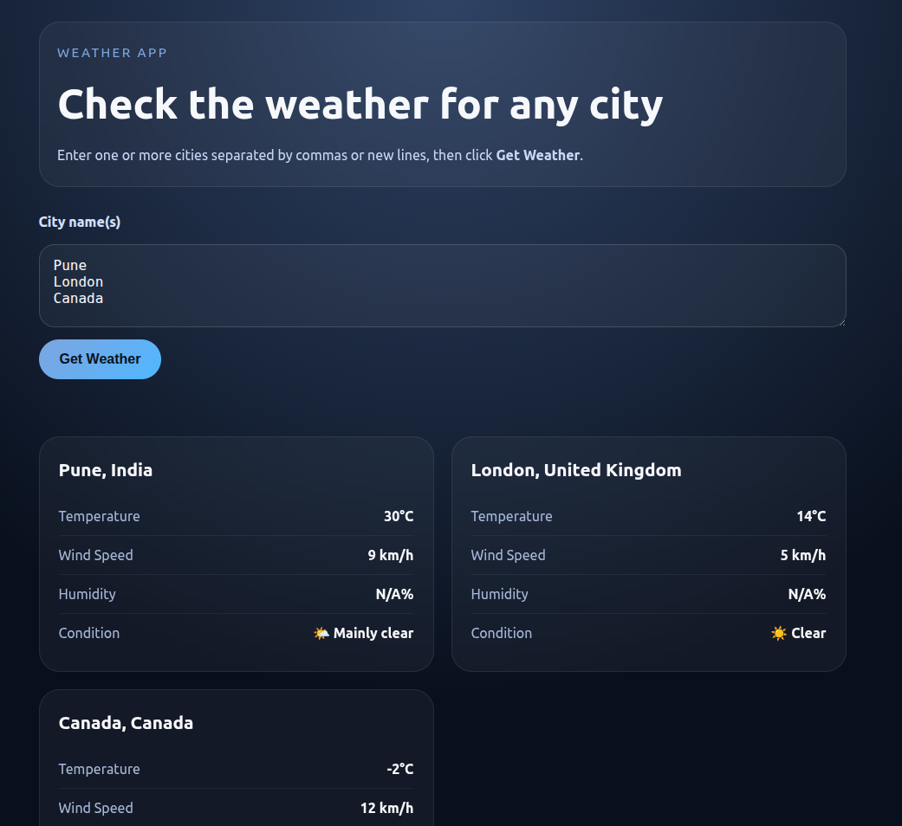

# 🌦️ Weather Application

## 📌 Overview

The Weather Application allows users to check current weather conditions for one or multiple cities. It uses the Open-Meteo APIs to fetch real-time weather data and displays it in a clean, user-friendly format.

---

## 🌐 Live Demo
👉 [Check out the Weather App](https://prathameshsurve.github.io/weatherapp/)

---

## 🚀 Features

### 🔍 Search Functionality

* Enter one or multiple city names
* Supports fetching weather for multiple cities at once

### 🔘 User Interaction

* “Get Weather” button to trigger API calls

### 📊 Weather Information Display

For each city:

* 🌡️ Temperature (°C)
* 💨 Wind Speed
* 💧 Humidity
* ☁️ Weather condition (e.g., Clear, Cloudy)

### ⚠️ Error Handling

* Displays error if:

  * City not found
  * API request fails
* Prevents app crashes and improves user experience

---

## 🛠️ Technologies Used

* HTML
* CSS
* JavaScript (Fetch API)
* Open-Meteo Geocoding API
* Open-Meteo Weather API

---

## 🔄 How It Works

1. User enters city name(s)
2. App calls Geocoding API → gets latitude & longitude
3. App calls Weather API using coordinates
4. Displays weather data on UI

---

## 🧪 Test Cases

### ✅ Test Case 1: Valid City Input

**Input:** Mumbai
**Expected Output:**

* Temperature displayed
* Wind speed shown
* Humidity shown
* Weather condition displayed

---

### ❌ Test Case 2: Invalid City Input

**Input:** xyzabc123
**Expected Output:**

* Error message: "City not found"

---

### ⚠️ Test Case 3: API Failure

**Scenario:** Network issue or API down
**Expected Output:**

* Error message: "Unable to fetch weather data"

---

## 🔐 Security & Best Practices

* Input validation for city names
* Proper error handling for API calls
* Avoid exposing sensitive data (if any API keys used)

---

## 📷 Screenshots

---

## 📌 Future Improvements

* Add weather icons
* Add 5-day forecast
* Save favorite cities
* Improve UI/UX
